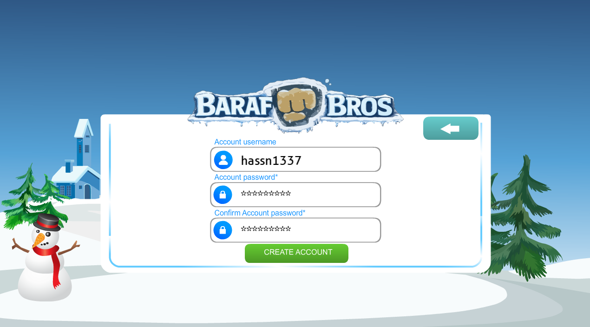
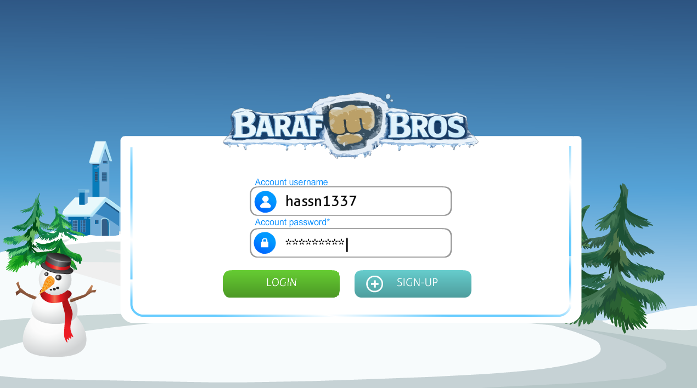
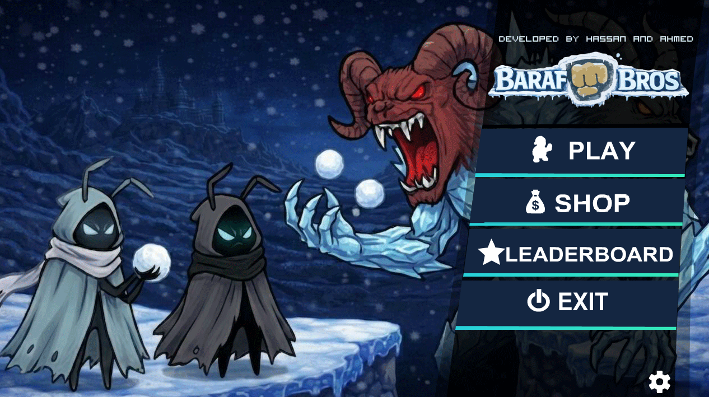
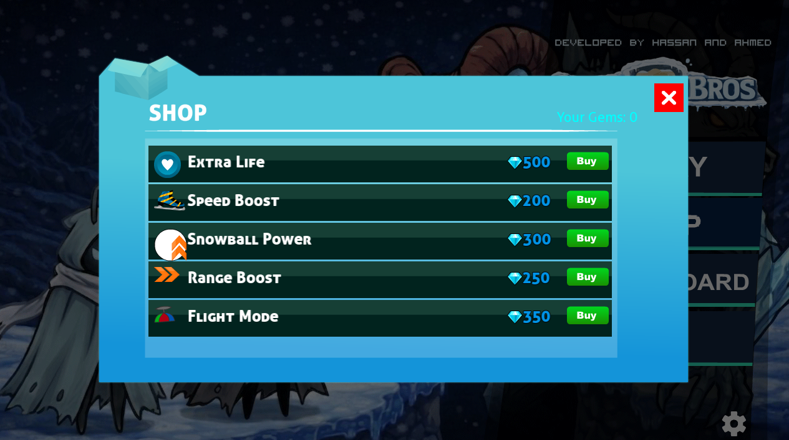
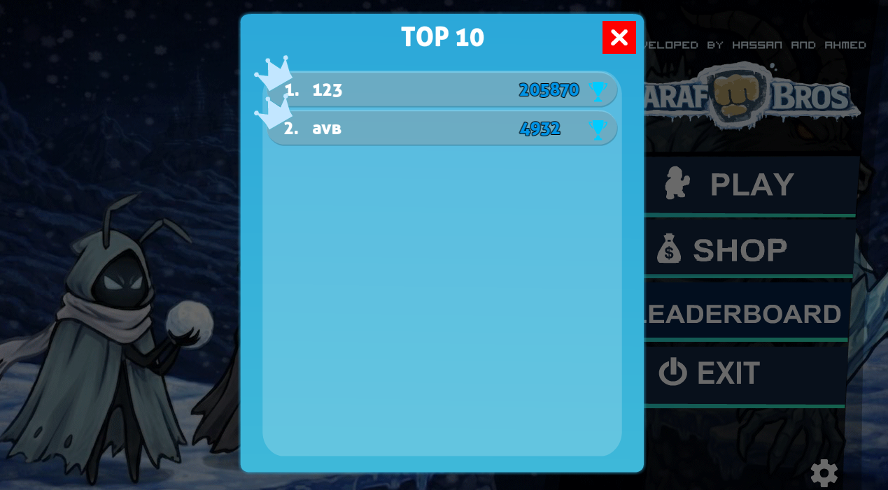
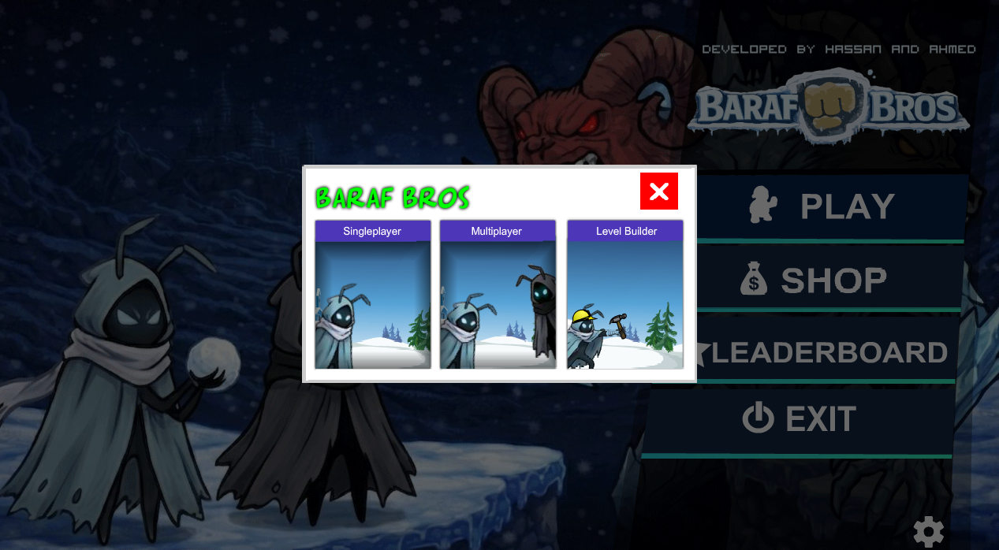
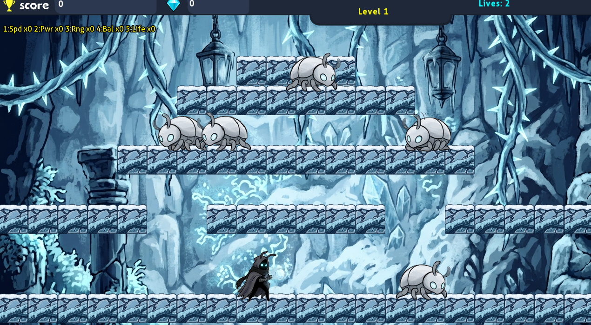
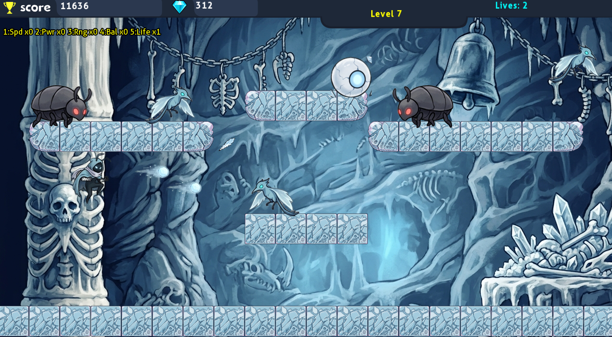
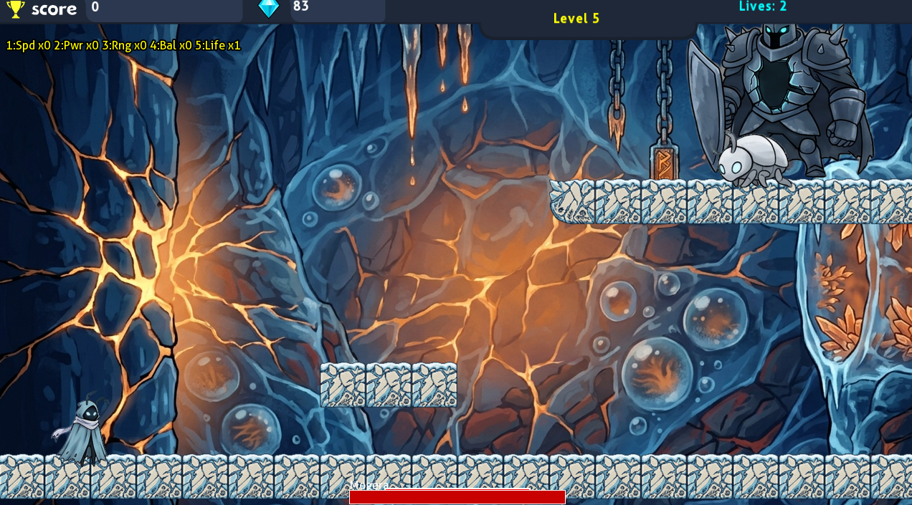
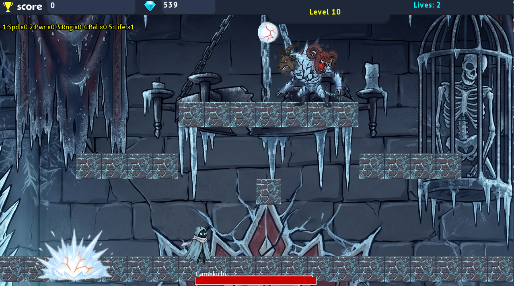

# Snow Bros - Object Oriented Programming Project

CS1004 Semester Project - Spring 2026

A complete 10-level replica of the classic 1990 arcade game Snow Bros, built with C++ and SFML 2.6.2.

---

## Game Overview

Control snowmen brothers through 10 levels of platform action. Throw snowballs at enemies to encase them in snow, then kick the snowballs to create chain reactions. Defeat bosses, collect gems, and rescue the princesses.

---

## Features

- 10 complete levels with increasing difficulty
- 5 enemy types: Botom, FlyingFoogaFoog, Tornado, Mogera (Boss), Gamakichi (Final Boss)
- 3 color variants per enemy (Blue, White, Black)
- 2 boss fights with health bars and special attacks
- 4 playable characters with unique spritesheets
- Single player and local multiplayer (2 players)
- Snowball encase mechanic with rolling chain reactions
- Power-up system: Speed Boost, Snowball Power, Range Increase, Balloon Mode, Extra Life
- In-game shop to buy power-ups with gems
- Bonus levels (4 and 9) with gem rain collection
- Level editor for creating custom levels
- User authentication with hashed passwords
- Save and load system with auto-save on level complete
- Leaderboard with top 10 scores
- Hitbox debug mode (F1/H key)
- Background music and sound effects with mute option

---

## Requirements

- Visual Studio 2022
- SFML 2.6.2
- Windows 10/11

---

## Installation and Setup

### Step 1: Download SFML 2.6.2

Download SFML 2.6.2 from the official website:
https://www.sfml-dev.org/download/sfml/2.6.2/

Choose: **Visual C++ 17 (2022) - 64-bit**

Extract the downloaded zip file to a location you remember, for example:
C:\SFML-2.6.2

### Step 2: Create a New Visual Studio Project

1. Open Visual Studio 2022
2. Click **Create a new project**
3. Select **Empty Project (C++)** and click Next
4. Name your project `SnowBros` and choose a location
5. Click **Create**

### Step 3: Add All Source Files

1. Copy all `.cpp` and `.h` files from the project folder into your Visual Studio project folder
2. In Visual Studio, right-click **Source Files** in Solution Explorer
3. Click **Add → Existing Item**
4. Select all `.cpp` files and click **Add**
5. Right-click **Header Files** in Solution Explorer
6. Click **Add → Existing Item**
7. Select all `.h` files and click **Add**

### Step 4: Copy Assets Folder

Copy the entire `assets` folder into your Visual Studio project folder (same location as the `.cpp` files). The structure should be:
YourProjectFolder/
├── main.cpp
├── Player.cpp
├── Player.h
├── ... (all other .cpp and .h files)
└── assets/  
    &nbsp;&nbsp;&nbsp;├── audio/  
    &nbsp;&nbsp;&nbsp;├── characters/  
    &nbsp;&nbsp;&nbsp;├── editor/  
    &nbsp;&nbsp;&nbsp;├── enemies/  
    &nbsp;&nbsp;&nbsp;├── fonts/  
    &nbsp;&nbsp;&nbsp;├── gameplay/  
    &nbsp;&nbsp;&nbsp;├── hud/  
    &nbsp;&nbsp;&nbsp;├── leaderboard/  
    &nbsp;&nbsp;&nbsp;├── levels/  
    &nbsp;&nbsp;&nbsp;├── login/  
    &nbsp;&nbsp;&nbsp;├── menu/  
    &nbsp;&nbsp;&nbsp;├── player/  
    &nbsp;&nbsp;&nbsp;├── projectiles/  
    &nbsp;&nbsp;&nbsp;├── settings/  
    &nbsp;&nbsp;&nbsp;├── shop/  
    &nbsp;&nbsp;&nbsp;└── tiles/  

### Step 5: Configure SFML in Visual Studio

**Set Include Path:**
1. Right-click your project in Solution Explorer → **Properties**
2. Select **C/C++ → General**
3. In **Additional Include Directories**, add:
C:\SFML-2.6.2\include

**Set Library Path:**
1. Select **Linker → General**
2. In **Additional Library Directories**, add:
C:\SFML-2.6.2\lib

**Link SFML Libraries:**
1. Select **Linker → Input**
2. In **Additional Dependencies**, add:
sfml-graphics-d.lib
sfml-window-d.lib
sfml-audio-d.lib
sfml-system-d.lib

(These are the Debug versions. For Release mode, remove the `-d` suffix.)

**Copy DLLs:**
Copy all `.dll` files from `C:\SFML-2.6.2\bin` to your project's output folder (where the `.exe` is created).

### Step 6: Build and Run

1. Set build configuration to **Debug** and **x64**
2. Press **F5** or click **Local Windows Debugger** to build and run
3. The game window should open with the login screen

---

## Project Structure

SnowBros/  
├── main.cpp  
├── HitBox.h / .cpp  
├── Character2D.h / .cpp  
├── GameManager.h / .cpp  
├── Player.h / .cpp  
├── Enemy.h / .cpp  
├── Botom.h / .cpp  
├── FlyingFoogaFoog.h / .cpp  
├── Tornado.h / .cpp  
├── Mogera.h / .cpp  
├── Gamakichi.h / .cpp  
├── EnemyFactory.h / .cpp  
├── ColorVariant.h / .cpp  
├── Snowball.h / .cpp  
├── Knife.h / .cpp  
├── ArtilleryRocket.h / .cpp  
├── Tile.h / .cpp  
├── Platform.h / .cpp  
├── EnemySpawnPoint.h / .cpp  
├── LevelData.h / .cpp  
├── LevelLoader.h / .cpp  
├── Scene.h / .cpp  
├── SceneManager.h / .cpp  
├── LoginScreen.h / .cpp  
├── RegisterScene.h / .cpp  
├── MenuScene.h / .cpp  
├── GameState.h / .cpp  
├── GameOverScene.h / .cpp  
├── LevelEditor.h / .cpp  
├── TextureButton.h / .cpp  
├── TextBox.h / .cpp  
├── Dialog.h / .cpp  
├── HUD.h / .cpp  
├── Spritesheet.h / .cpp  
├── Shop.h / .cpp  
├── ShopItem.h / .cpp  
├── LeaderboardDialog.h / .cpp  
├── LeaderboardItem.h / .cpp  
├── playDialog.h / .cpp  
├── NewGameDialog.h / .cpp  
├── SettingsDialog.h / .cpp  
├── CharacterSelect.h / .cpp  
├── AuthManager.h / .cpp  
├── InputManager.h / .cpp  
├── PowerUpSystem.h / .cpp  
├── ShopSystem.h / .cpp  
├── SaveManager.h / .cpp  
└── assets/  
&nbsp;&nbsp;&nbsp;├── audio/  
&nbsp;&nbsp;&nbsp;├── characters/  
&nbsp;&nbsp;&nbsp;├── editor/  
&nbsp;&nbsp;&nbsp;├── enemies/  
&nbsp;&nbsp;&nbsp;├── fonts/  
&nbsp;&nbsp;&nbsp;├── gameplay/  
&nbsp;&nbsp;&nbsp;├── hud/  
&nbsp;&nbsp;&nbsp;├── leaderboard/  
&nbsp;&nbsp;&nbsp;├── levels/  
&nbsp;&nbsp;&nbsp;&nbsp;&nbsp;&nbsp; ├── levels.cfg  
&nbsp;&nbsp;&nbsp;&nbsp;&nbsp;&nbsp; ├── level1/ ... level10/  
&nbsp;&nbsp;&nbsp;├── login/  
&nbsp;&nbsp;&nbsp;├── menu/  
&nbsp;&nbsp;&nbsp;├── player/  
&nbsp;&nbsp;&nbsp;├── projectiles/  
&nbsp;&nbsp;&nbsp;├── settings/  
&nbsp;&nbsp;&nbsp;├── shop/  
&nbsp;&nbsp;&nbsp;└── tiles/  

---

## Controls

### Player 1
| Action | Key |
|--------|-----|
| Move Left | A |
| Move Right | D |
| Jump | W |
| Throw Snowball | Space |

### Player 2 (Multiplayer)
| Action | Key |
|--------|-----|
| Move Left | Numpad 4 |
| Move Right | Numpad 6 |
| Jump | Numpad 8 |
| Throw Snowball | Numpad 0 |

### Power-Ups (Both Players)
| Power-Up | Key |
|----------|-----|
| Speed Boost | B |
| Snowball Power | N |
| Range Increase | M |
| Balloon Mode | V |
| Extra Life | C |

### General
| Action | Key |
|--------|-----|
| Pause | P or Escape |
| Hitbox Debug | F1 or H |
| Exit to Menu | Escape (when paused or game over) |

### Level Editor
| Action | Control |
|--------|---------|
| Select Tile | Click tile button or press 0-5 |
| Place Tile | Left Click |
| Commit Platform | Right Click or Enter |
| Select Enemy Tool | Click Enemy button or press 6 |
| Cycle Enemy Type | Click Next button |
| Cycle Variant | V key |
| Place Player Spawn | Press 7 (P1) or 8 (P2) |
| Save Level | Click Save button |
| Load Level | Click Load button |

---

## Gameplay

### Core Mechanics

1. Throw snowballs at enemies to encase them in snow
2. Partially encased enemies are slowed but still dangerous
3. Fully encased enemies become rollable snowballs
4. Walk into an encased enemy to kick it
5. Rolling snowballs hit other enemies for chain reactions
6. Clear all enemies on screen to advance to the next level

### Scoring
- Botom: 100-500 points
- FlyingFoogaFoog: 200-800 points
- Tornado: 300-1200 points
- Chain Kill Bonus: +10% per enemy in chain
- Mogera (Boss): 5000 points + 200 gems
- Gamakichi (Boss): 10000 points + 500 gems

### Power-Ups
Power-ups appear when enemies are defeated. Buy more from the shop using gems.

### Boss Levels
- Level 5: Mogera - spawns children, 6 health
- Level 10: Gamakichi - fires rockets, 12 health, 3 phases

### Bonus Levels
Levels 4 and 9: Gem rain after clearing all enemies. Collect gems for bonus points.

---

## Screenshots

### Register Screen

### Login Screen

### Main Menu

### Shop

### Leaderboard

### Play Options

### Gameplay

### Boss Fight - Mogera

### Boss Fight - Gamakichi

---

## OOP Design

### Inheritance
Character2D is the physics base class. Player and Enemy inherit from it. Enemy is an abstract base with pure virtual updateAI() and draw() methods. Botom inherits from Enemy, FlyingFoogaFoog inherits from Botom, and Tornado inherits from FlyingFoogaFoog (3 levels of inheritance).

### Polymorphism
Enemy::updateAI() is overridden by each enemy type with unique behavior. Scene::update(), draw(), and handleEvent() are pure virtual across all screens. The game loop calls updateCommon() on every enemy polymorphically.

### Design Patterns
- Factory Pattern: EnemyFactory creates enemies by string name
- State Pattern: SceneManager manages game states
- Strategy Pattern: Each enemy has its own AI strategy
- Observer Pattern: Buttons notify parent scenes on click

### Key OOP Concepts
- Encapsulation: All entity state is private with getters/setters
- Abstraction: Character2D, Enemy, Scene, Dialog are abstract
- Composition: Player has Spritesheet, HitBox, Sound components

---

## Level Editor

A visual editor for creating custom levels. Features include:
- Place 64x64 tiles on a grid
- 18 tile types (paged 3 at a time)
- Spawn enemies with type and color variant selection
- Set Player 1 and Player 2 spawn positions
- Save and load level files
- Ghost tile preview follows mouse

---

## Data-Driven Levels

Level count is controlled by `assets/levels/levels.cfg`:
levelCount = 10  
Default it  set to 10 if file does not exist.  
To add more levels, change this number and add corresponding level folders with data files. No code changes needed.

---

## Troubleshooting

**Game doesn't start:**
- Make sure SFML DLLs are in the same folder as the .exe
- Check that the assets folder is in the correct location

**No audio:**
- Verify audio files exist in assets/audio/
- Check that mute is not enabled in Settings

**Login fails:**
- First time users must register an account
- users.txt is created in the working directory

---

## Notes

- Passwords are hashed before storage (not plain text)
- Game progress auto-saves on level complete
- Leaderboard keeps only the highest score per player